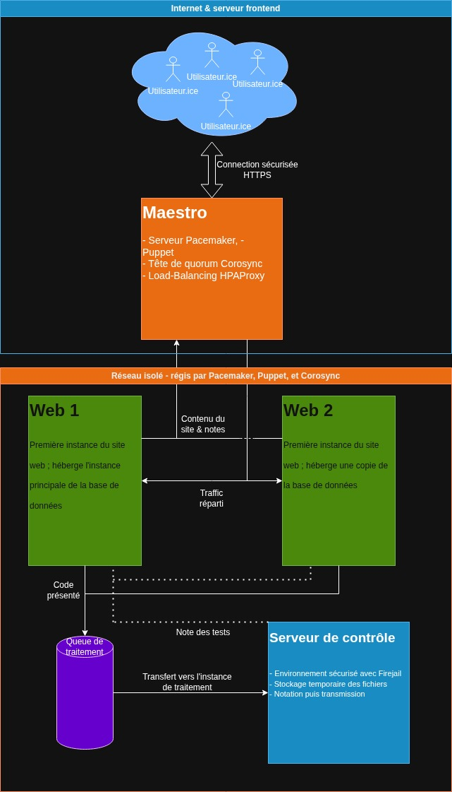

# 3LPIC
---
## Architecture système



## Choix des technologies
- Firejail
    Firejail permet, en utilisant les namespaces & seccomp-bpf, permettant un sandboxing des appels systèmes ainsi que des accès à
    l'arborescence de fichiers, ainsi que l'accès à Internet.
    Habituellement utilisé dans le but de s'assurer que les applications ne fassent pas usage de permissions qui ne leurs sont pas
    destinées, les fonctions de sandboxing sont parfaites pour le traitement et l'exécution de code de manière automatique.

- Corosync, Puppet et Pacemaker
    Puppet permet l'automatisation du déploiement de configuration à travers un réseau, ce qui facilite un éventuel scaling horizontal
    de l'infrastructure.
    Corosync & Pacemaker permettent la gestion de ressources et la haute disponibilité dans un environnement Linux, et la prise de décisions
    quand à l'attribution des ressources.

- React
    React permet la création d'applications avec Typescript, le tout avec un environnement facile d'entretient, léger et flexible.

- MongoDB
    MongoDB permet la réplication des données (grâce aux `replica-set`s) et a un schéma flexible tout en permettant le traitement des données
    en JSON. De plus, la scalabilité horizontale de cette solution est adaptée aux besoins de notre infrastructure.

- Apache2
    Permet le déploiement de sites web, et est presque symbiotique avec les environnements Linux. De plus, Apache nous permet d'installer 
    un certificat SSL/TLS facilement, afin d'avoir un chiffrement des données en transit entre les utilisateurs et le frontend de l'infrastructure.
---


## Dev note
> [!NOTE]DB
> Les bases de données MongoDB utilisent le port `27017`

> [!IMPORTANT] `Maestro` vs `load-balancer`
> Les deux noms font référence à la même machine : celle qui héberge le load-balancer ainsi que
> les serveurs Puppet, Corosync et Pacemaker

## Scripts 
`redoing.sh`
Ce script sert à mettre en place une VM après qu'elle aie été clonée.

## Site web Coursero
Apache s'attend à ce que les fichiers du site web soient dans `/var/www/www.coursero.com`. Ce faisant, il vous faudra suivre les étapes ci-dessous :
1. Cloner le dépôt `git`
```bash
git clone https://github.com/TheDarkWolfer/3LPIC
```

2. Build le projet
```bash
cd ./3LPIC/website
npm install
npm run build
```

3. Déplacer les fichiers statiques
```bash
mv ./build/ /var/www/www.coursero.com/
```

## HTTPS

### Certificat TLS
Pour que les données transmises sur le site soient sécurisées, nous devons créer un certificat SSL/TLS. Pour un environnement de test, on peut utiliser OpenSSL et créer des certificats autosignés ; pour un environnement de déploiement réel, nous pourrons utiliser certbot et letsencrypt.

#### Old Reliable : Méthode OpenSSL
1. Installation
```bash
sudo apt update 
sudo apt install openssl -y
```

2. Génération d'une clef privée, ici RSA de 2048 bits, et création d'un certificat avec la clef associée
> [!INFO]
> La création du certificat nécessite de répondre à quelques questions sur les différents détails attachés
> au certificat.
```bash
sudo openssl req -x509 -nodes -days 365 -newkey rsa:2048 \
      -keyout /etc/ssl/private/coursero.key \
      -out /etc/ssl/certs/coursero.crt
```

3. Vérification du certificat
```bash
openssl x509 -in /etc/ssl/certs/coursero.crt -text -noout
```

4. Permissions des fichiers
```bash
sudo chmod 600 /etc/ssl/private/coursero.key
sudo chmod 644 /etc/ssl/certs/coursero.crt
```

### Configuration Apache2
```conf
# Redirection automatique si quelqu'un se connecte en HTTP
# Bon vieux p'tit https://http.cat/status/308
<VirtualHost *:80> 
      ServerName www.coursero.com
      Redirect permanent / https://www.coursero.com/
</VirtualHost> 

<VirtualHost *:443> 

      # Informations basiques du site web (fausse adresse mail bien sûr) 
      ServerName www.coursero.com
      ServerAdmin camille@coursero.com

      # [!] À modifier pour être en accord avec le site créé par Dimitri
      DocumentRoot /var/www/www.coursero.com

      ErrorLog /var/log/apache2/www.coursero.com/error.log
      CustomLog /var/log/apache2/www.coursero.com/access.log combined
      LogLevel warn
      
      # Faut tout ça pour avoir une connection HTTPS
      SSLEngine on
      SSLCertificateFile      /etc/ssl/certs/coursero.crt
      SSLCertificateKeyFile   /etc/ssl/private/coursero.key
</VirtualHost> 
```

## Load balancing avec Pacemaker
1. Installation de pacemaker (toutes les machines)
```bash
sudo apt update
sudo apt install pacemaker corosync pcs crmsh apache2
```

2. Configuration de corosync sur le *load balancer*
```bash
sudo corosync-keygen
```

3. Copie de la clef sur les machines `travailleuses` (présumant une installation avec hyperviseur)
```bash
scp -i ~/.ssh/id_rsa root@vm-load-balancer:/etc/corosync/authkey .
scp -i ~/.ssh/id_rsa authkey web-one@vm-web-one:/tmp/
scp -i ~/.ssh/id_rsa authkey web-one@vm-web-two:/tmp/
```

4. Gestion de la clef sur les travailleuses
```bash
sudo mv /tmp/authkey /etc/corosync/authkey
sudo chown root:root /etc/corosync/authkey
sudo chmod 400 /etc/corosync/authkey
```

5. `/etc/corosync/corosync.conf` sur les trois machines
> [!IMPORTANT] 
> Les blocs `node` sont à dupliquer pour chaque machine, et il faudra également accorder les adresses IPs,
> ainsi que les noms, à votre plan d'adressage (ici, basé sur l'adressage Qemu)
```conf
# Caractéristiques du cluster
totem {
      version: 2
      cluster_name: coursero
transport: udpu
      interface {
          ringnumber: 0
          
          # Adresse basée sur les subnets générés par Libvirt/Qemu ; à ajuster lors du déploiement réel
          bindnetaddr: 192.168.122.0
          mcastport: 5405
      }
}

nodelist {
      # Noeud de l'équilibreur de charges (c'est pas un ELB mais ça fonctionne ^^)
      node {
          ring0_addr: 192.168.122.28
          name: load-balancer
          nodeid: 1
      }
      
      # Première instance de site web
      node {
          ring0_addr: 192.168.122.111
          name: web-one
          nodeid: 2
      }
      node {
          ring0_addr: 192.168.122.76
          name: web-two
          nodeid: 3
      }
      node {
          ring0_addr: 192.168.122.45
          name: code-examiner
          nodeid: 4
      }
}

# On log tout ça dans les fichiers système
logging {
      to_logfile: yes
      logfile: /var/log/corosync/corosync.log
      to_syslog: yes
}

# Faut un bloc pour le quorum, sinon corosync s'énèrve -_-
quorum {
      provider: corosync_votequorum
}


```
> [!NOTE] On applique la configuration avec `sudo systemctl restart corosync` ; si besoin est, on l'active au démarrage avec `sudo systemctl enable --now corosync`

6. Activation de pacemaker
```bash
sudo systemctl enable --now pacemaker

# Vérification
sudo crm status
```
Exemple de résultat de la commande `crm status` :
```bash
sudo crm status # Élévation de privilèges nécessaire

Cluster Summary:
    * Stack: corosync (Pacemaker is running)
    * Current DC: web-two (version 3.0.0-3.0.0) - partition with quorum
    * Last updated: Fri Mar 20 23:16:58 2026 on maestro
    * Last change:  Fri Mar 20 23:16:24 2026 by root via root on maestro
    * 3 nodes configured
    * 0 resource instances configured

Node List:
    * Online: [ maestro web-one web-two code-examiner ]

Full List of Resources:
    * No resources
```

7. Désactivation de la politique "*S*hoot *T*he *O*ther *N*ode *I*n *T*he *H*ead" 
> [!IMPORTANT]
> inutile dans un cluster aussi petit, avec un quorum décisionnel impair
> À lancer sur la machine décisionnelle (ici `maestro`)
```bash
sudo crm configure property stonith-enabled=false
```

8. Paramétrage d'une plage d'IPs virtuelles
> [!IMPORTANT]
> Permet aux machines de travailler même sans le maestro, au cas où ce dernier 
> viendrait à manquer à l'appel
```bash
sudo crm configure primitive virtual-ip ocf:heartbeat:IPaddr2 \
      params ip="192.168.122.100" \
      cidr_netmask="24" \
      op monitor interval="30s"
```

9. Paramétrage d'une ressource Apache qu'on va affecter aux VMs 
> [!INFO]
> Le paramètre "configfile" permet de savoir où se trouve le fichier de config Apache
```bash
crm configure primitive apache-web \
      ocf:heartbeat:apache \
      params configfile="/etc/apache2/sites-available/www.coursero.fr.conf" \
      op monitor interval="30s"
```

## Gestion des machines travailleuses avec Puppet
1. Installer le serveur Puppet sur `load-balancer`
```bash
sudo apt install puppetserver
```

2. Modifier la configuration du serveur
```bash
sudo mkdir -p /etc/puppetlabs/puppetserver/
sudo nano /etc/puppetlabs/puppetserver/puppetserver.conf
```

```conf
[main]
certname = maestro
server = maestro
environment = production

[server]
vardir = /opt/puppetlabs/server/data/puppetserver
logdir = /var/log/puppetlabs/puppetserver
rundir = /var/run/puppetlabs/puppetserver
pidfile = /var/run/puppetlabs/puppetserver/puppetserver.pid
codedir = /etc/puppetlabs/code
```

3. Configuration d'un manifeste de site
> [!INFO] 
> Le manifest s'occupe de l'installation des paquets et de la distribution des configurations
> de manière adaptée. Cet outil a été choisi pour éviter la réécriture constante des configurations
> et des commandes d'installation sur chaque VM : en bref, meilleure scalabilité que Ctrl+C/Ctrl+V
```puppet
# Gestion des deux noeuds webservers
node 'web-one', 'web-two' {
    # Apache + SSL
    package { 'apache2':
      ensure => installed,
    }

    service { 'apache2':
      ensure => running,
      enable => true,
      require => Package['apache2'],
    }

    # Activation du module SSL/TLS
    exec { 'enable-ssl':
      command => '/usr/sbin/a2enmod ssl',
      creates => '/etc/apache2/mods-enabled/ssl.load',
      notify  => Service['apache2'],
    }

    # Configuration de l'hôte virtuel SSL
    file { '/etc/apache2/sites-available/ssl.conf':
      ensure  => file,
      content => template('apache_ssl/ssl.conf.erb'),
      notify  => Service['apache2'],
      require => Exec['generate-ssl-cert'],
    }

    exec { 'enable-ssl-site':
      command => '/usr/sbin/a2ensite ssl',
      creates => '/etc/apache2/sites-enabled/ssl.conf',
      notify  => Service['apache2'],
      require => File['/etc/apache2/sites-available/ssl.conf'],
    }

    # Installation de mongodb - basé sur https://www.mongodb.com/docs/v8.0/tutorial/install-mongodb-on-debian/, car manquant des dépôts APT ᵕ—ᴗ—
    exec { 'mongodb-gpg-key':
      command => '/usr/bin/curl -fsSL https://www.mongodb.org/static/pgp/server-7.0.asc | /usr/bin/gpg --dearmor -o /usr/share/keyrings/mongodb-server-7.0.gpg',
      creates => '/usr/share/keyrings/mongodb-server-7.0.gpg',
    }

    # Ajout de MongoDB dans la liste de dépôts ; permet la mise à jour automatique avec APT
    file { '/etc/apt/sources.list.d/mongodb-org-7.0.list':
      ensure  => file,
      content => "deb [signed-by=/usr/share/keyrings/mongodb-server-7.0.gpg] http://repo.mongodb.org/apt/debian bookworm/mongodb-org/7.0 main\n",
      require => Exec['mongodb-gpg-key'],
      notify  => Exec['apt-update-mongo'],
    }

    # Mise à jour de la liste de paquets ; nécessaire pour l'installation et la mise à jour
    exec { 'apt-update-mongo':
      command     => '/usr/bin/apt-get update',
      refreshonly => true,
    }

    # Installation MongoDB
    package { 'mongodb-org':
      ensure  => installed,
      require => Exec['apt-update-mongo'],
    }

    # Création de la config sur les deux instances
    file { '/etc/mongod.conf':
      ensure  => file,
      content => @("CONF"),
        storage:
          dbPath: /var/lib/mongodb

        systemLog:
          destination: file
          path: /var/log/mongodb/mongod.log
          logAppend: true

        net:
          port: 27017
          bindIp: 0.0.0.0

        replication:
          replSetName: "rs-coursero"
        | CONF
      require => Package['mongodb-org'],
      notify  => Service['mongod'],
    }

    # Démarrer les instances
    service { 'mongod':
      ensure  => running,
      enable  => true,
      require => Package['mongodb-org'],
    }

}

node 'maestro' {
    # Maestro est grand, il se gère tout seul
}
```
4. Signature des demandes Puppet des agents des travailleuses
Cette commande accepte toutes les requêtes des agents puppet quand à leur enrôlement dans le cluster ;
```bash
sudo puppetserver ca sign --all
```

### Sur les machines travailleuses
1. Installation de l'agent Puppet
```bash
sudo apt update && sudo apt install puppet-agent -y
```

2. Configuration minimale de l'agent Puppet
> [!NOTE] 
> Cette configuration se fait dans `/etc/puppetlabs/puppet/puppet.conf`
> Il faudra potentiellement ajouter l'adresse du serveur Puppet dans `/etc/hosts`
```conf
[main]
server=maestro
```

3. Lancement de l'agent & démarrage automatique
```bash
sudo systemctl enable --now puppet
```

4. Création d'un replica set sur une instance
> [!IMPORTANT]
> Vous devrez choisir une instance parmi celles ayant une base de données MongoDB, et initialiser un `replica set`
> afin d'assurer l'intégrité des données qui s'y trouvent, et leur réplication sur une autre instance.
> Il vous faudra ajuster les adresses IPs pour que l'adresse de priorité 1 soit l'autre instance MongoDB, et celle de
> priorité 2 soit l'instance hébergée sur l'hôte sur lequel vous lancez la commande.
```bash
mongosh --eval '
rs.initiate({
  _id: "rs-coursero",
  members: [
    { _id: 0, host: "192.168.122.111:27017", priority: 2 },
    { _id: 1, host: "192.168.122.76:27017", priority: 1 }
  ]
})
'
```

## Load Balancing
Pour assurer l'accessibilité des instances de rendu, nous utilisons HAProxy afin
d'en assurer la haute disponibilité et l'équilibrage du traffic. 
N'ayant pas besoin de plus d'un load balancer pour l'instant, cette configuration n'est 
pas répliquée avec Puppet.

1. Installation (sur `maestro`)
```bash
sudo apt install -y haproxy
```

2. Configuration dans /etc/haproxy/haproxy.cfg
> [!IMPORTANT]
> Encore une fois, il vous faudra ajuster les adresses IPs afin de les faire correspondre 
> aux adresses de vos instances web
```conf
global
    log /dev/log local0
    maxconn 256

defaults
    log     global
    mode    http
    option  httplog
    timeout connect 5s
    timeout client  30s
    timeout server  30s

frontend coursero-front
    bind *:80
    bind *:443 ssl crt /etc/ssl/private/coursero.pem
    redirect scheme https code 308 if !{ ssl_fc }
    default_backend web-servers

backend web-servers
    balance roundrobin
    option httpchk GET /
    server web-one 192.168.122.111:443 check ssl verify none
    server web-two 192.168.122.76:443 check ssl verify none
```

3. Concaténation certificat + clef
HAProxy a besoin d'un fichier combiné pour le certificat & sa clef, obtenable
comme suit ; cette chaîne de certificats se trouvera dans `/etc/ssl/private/coursero.pem`
```bash
sudo cat /etc/ssl/certs/coursero.crt /etc/ssl/private/coursero.key > >  /etc/ssl/private/coursero.pem
```

4. Démarrer HAProxy sur `maestro`
```bash
sudo systemctl enable --now haproxy

# Vérification
sudo systemctl status haproxy | less
```

5. Ajout de HAProxy en tant que ressource Pacemaker
Pacemaker peut surveiller HAProxy afin de s'assurer qu'iel ne s'arrête pas, et 
pour le relancer en cas de besoin. On va surveiller HAProxy toutes les dix secondes,
étant un élément crucial de l'infrastructure
```
sudo crm configure primitive \
    haproxy-svc systemd:haproxy \
    op monitor interval="10s"
```

6. Colocation forcée entre la ressource HAProxy & l'adressage virtuel Pacemaker
Ces deux ressources sont co-dépendantes, et doivent donc être migrées sur le même
hôte en cas d'échec critique.
```bash
sudo crm configure colocation haproxy-with-vip inf: haproxy-svc virtual-ip
```

7. Ordre de création HAProxy / Virtual IP
HAPRoxy dépend des plages d'adresses virtuelles ; ce faisant, nous le configurons afin que les 
adresses virtuelles soient créées avant HAProxy
```bash
sudo crm configure order vip-then-haproxy mandatory: virtual-ip haproxy-svc
```

## Mise en place de l'instance de correction
1. Installation des prérequis
```bash
sudo apt update && sudo apt install firejail python3 python3-pip gcc nodejs npm mongodb-org

pip3 install pymongo
```

2. Récupérer les différents fichiers depuis le dépôt git, dans la section `exercises`
Il faudra arranger les différents scripts comme suit ;
```
/var/www/coursero/◄───Répertoire apache
├── scripts/
│   ├── correction.py
│   ├── queue_worker.py
│   ╰── seed_db.py
├── exercises/
│   ╰── <course_id> /
│       ╰── <exercise_id> /
│           ╰── tests.json
├── submissions/  (fichiers temporaires)
╰── website/      (application React)
```

3. Installation des différents composants
    - 1. Création d'un utilisateur dédié
    ```bash
    sudo useradd -r -s /bin/false coursero
    sudo mkdir -p /var/www/coursero/{scripts,exercises,submissions}
    sudo mkdir -p /var/log/coursero
    sudo chown -R coursero:coursero /var/www/coursero /var/log/coursero
    ```

    - 2. Déploiement des scripts et des services systemd
    ```bash
    sudo cp scripts/*.py /var/www/coursero/scripts/
    sudo chmod +x /var/www/coursero/scripts/*.py

    sudo cp -r exercises/* /var/www/coursero/exercises/
    ```

    - 3. Lancement des services systemd
    ```bash
    sudo cp scripts/coursero-worker.service /etc/systemd/system/
    sudo systemctl daemon-reload
    sudo systemctl enable coursero-worker
    sudo systemctl start coursero-worker
    ```

    - 4. (Optionel) Remplissage de la base de données
    ```bash
    python3 /var/www/coursero/scripts/seed_db.py
    ```

    - 5. Déploiement du serveur
    ```bash
    cd server
    npm install
    # Configurer .env
    cp .env.example .env
    # Lancer le serveur
    pm2 start index.js --name coursero-api
    ```


4. Format de tests : 
```json
{
  "exercise_id": "ex1",
  "course_id": "docker",
  "title": "Hello World",
  "tests": [
    {
      "name": "Basic output",
      "args": [],
      "expected_output": "Hello, World!"
    },
    {
      "name": "With argument",
      "args": ["John"],
      "expected_output": "Hello, John!"
    }
  ]
}
```

5. Exécution
> [!IMPORTANT] 
> Les tests s'exécutent automatiquement et retransmettent les données aux 
> bases de données, en attente d'affichage aux utilisateur.ices
